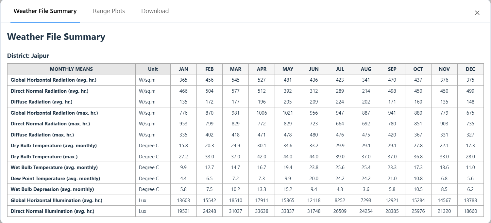
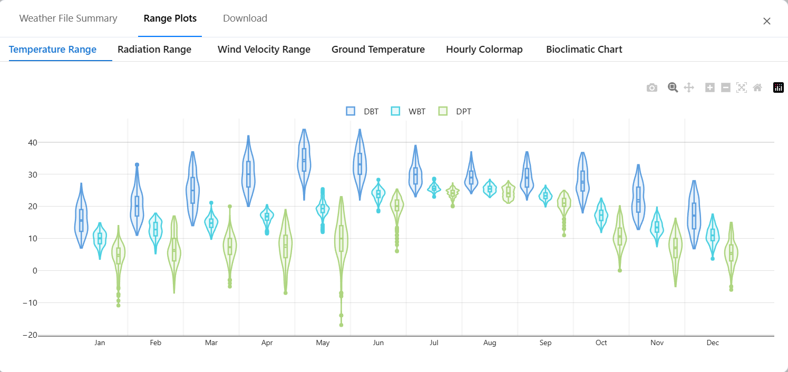
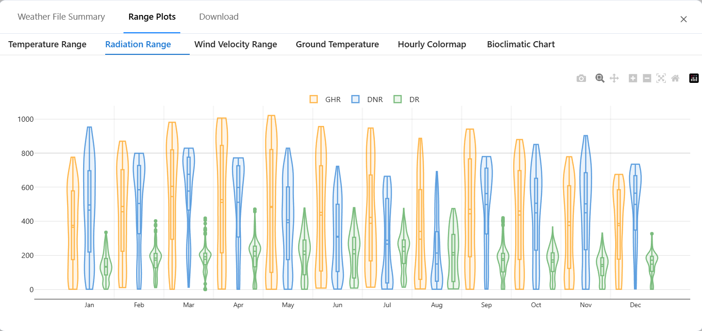
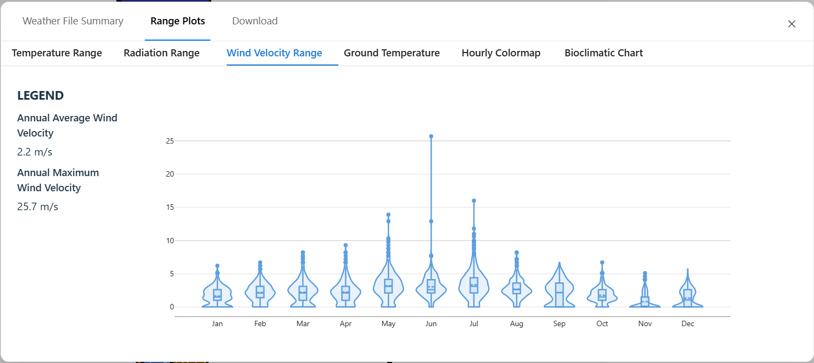
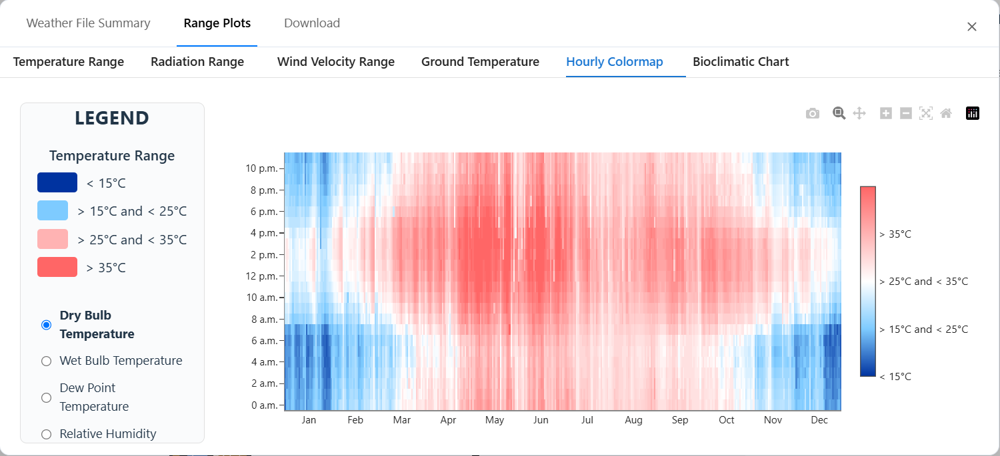
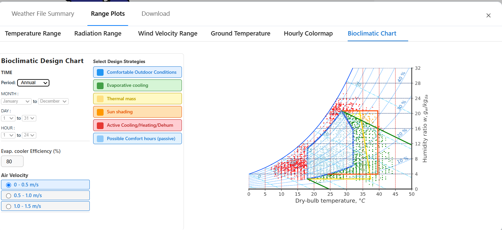
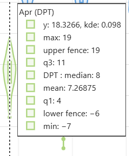
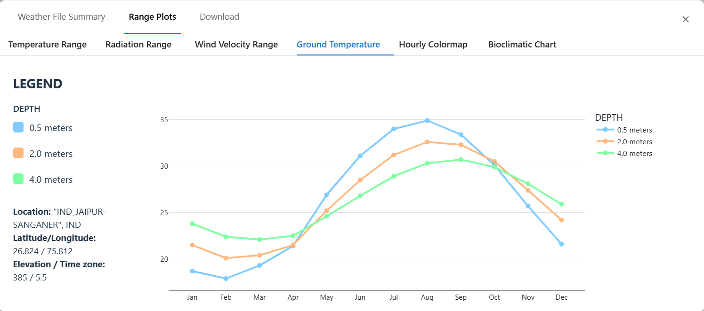
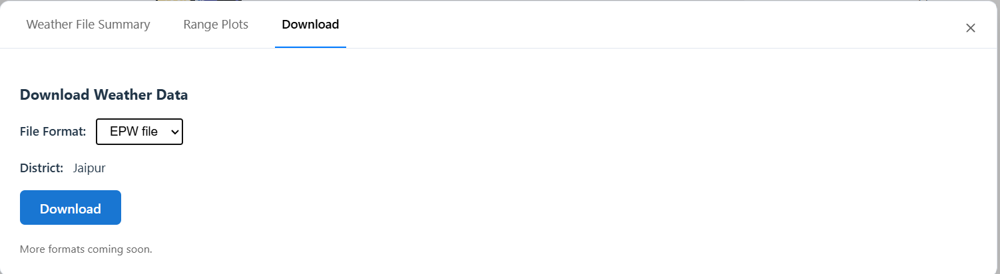
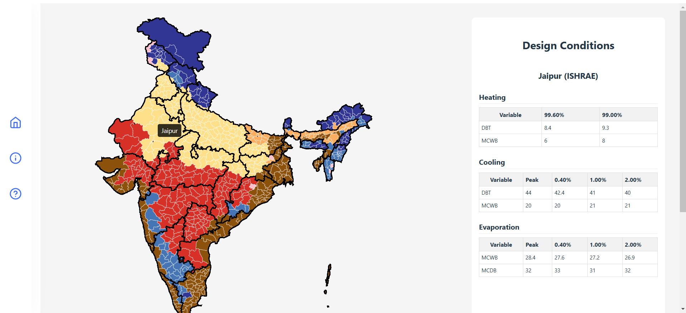

# Indian Climate Analysis Platform

A comprehensive platform for interactive climate data visualization, analysis, and downloads for all districts of India. The project combines a modern web frontend, a Node.js/Express backend, and advanced Python-based climate analysis tools.

---

## Features

- **Interactive Map**: Explore India's districts, view climate zones, and design conditions.
- **District Climate Analysis**: Visualize weather summaries, temperature profiles, radiation, wind, heat maps, and psychrometric charts.
- **Data Downloads**: Download climate data in EPW, BINM, and CSV formats for each district.
- **Advanced Analysis**: Python tools for in-depth climate and passive design analysis, including a full-featured GUI.

---

## Directory Structure

```
├── backend/        # Node.js/Express backend API
├── frontend/       # React + Vite frontend app
├── python/         # Python climate analysis tools (PyQt5 GUI, scripts)
├── Poster.pdf      # Project poster/overview (binary)
├── design_conditions(3).xlsx # Climate data
├── package.json    # Root dependencies (minimal)
```

---

## Visual Guide to Images

The application uses a variety of images to enhance the user experience and provide visual context for climate data and institutional partners.

### Analysis & Data Visualization Images

| Image | Description | Where Used |
|-------|-------------|------------|
|  | Weather summary table/overview for a district | How To Use, Analysis |
|  | Monthly temperature profile (violin plots) | How To Use, Analysis |
|  | Monthly global and diffuse radiation | How To Use, Analysis |
|  | Wind speed by month | How To Use, Analysis |
|  | High-resolution heat maps for selected parameters | How To Use, Analysis |
|  | Interactive psychrometric chart with comfort zones and passive strategies | How To Use, Analysis |
|  | Detailed temperature violin plot (used in advanced analysis) | Analysis/Downloads |
|  | Ground temperature visualization | Analysis/Downloads |
|  | Screenshot of the download tab interface | How To Use, Downloads |
|  | Main landing page or home screen illustration | Home Page |

### Institutional and Partner Logos

| Image | Description | Where Used |
|-------|-------------|------------|
|  | MNIT Jaipur logo | Navigation bar |
|  | COLBE (Climate and Outdoor Laboratory for Building Engineering) | About > Sources |
|  | ASHRAE (American Society of Heating, Refrigerating and AC Eng.) | About > Sources |
|  | ISHRAE (Indian Society of Heating, Refrigerating and AC Eng.) | About > Sources |

---

## Getting Started

### Prerequisites

- Node.js (v18+ recommended)
- Python 3.8+

---

### 1. Frontend (React + Vite)

```sh
cd frontend
npm install
npm run dev
```
- Visit [http://localhost:5173](http://localhost:5173) to view the app.
- Main features: interactive map, district analysis, data downloads.

---

### 2. Backend (Node.js/Express)

```sh
cd backend
npm install
node app.js
```
- Runs on [http://localhost:3000](http://localhost:3000) by default.
- Serves API endpoints for climate data and downloads.
- CORS is restricted to the deployed Netlify frontend by default (see `app.js`).

---

### 3. Python Tools (Passive Design Consultant)

```sh
cd python
pip install -r requirements.txt
python Passive_Design_Consultant.py
```
- Launches a PyQt5 GUI for advanced climate and passive design analysis.
- Additional scripts for psychrometric and climate data processing are included.

---

## Usage

- **Frontend**: Use the interactive map to select districts, view climate analysis, and download data.
- **Backend**: Provides API endpoints for frontend and data services.
- **Python**: Use the GUI for in-depth analysis, or run scripts for batch processing.

---

## Data Sources

- Climate data and district boundaries are included in the repository (`frontend/india.geojson`, `frontend/india.json`, `.xlsx` files).
- Institutional partners: ISHRAE, ASHRAE, COLBE, MNIT Jaipur.

---

## Contributing

Pull requests and issues are welcome! Please open an issue to discuss major changes.

---

## License

This project is for academic and research use. See individual file headers for details. 